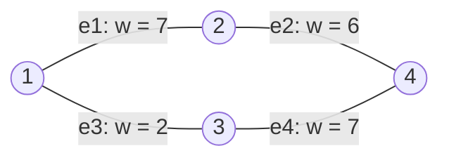

# `test02.uwg` graph

`M = 10`

All edges are undirected.

```mermaid
graph LR
    v1((1)) ---|e1: w = 7| v2((2))
    v2 ---|e2: w = 6| v4((4))
    v1 ---|e3: w = 2| v3((3))
    v3 ---|e4: w = 7| v4
```
